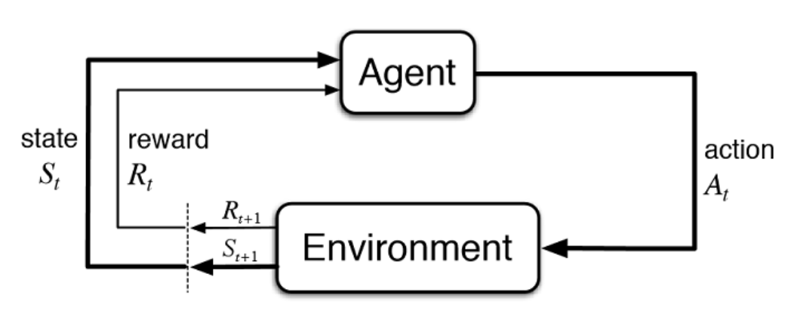
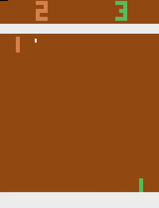

# RL Agent for Atari Game Pong

## Reinforcement learning (RL)
Reinforcement learning is a branch of machine learning which concerned with learning from expreince in an environment and maximize a reward signal.

|  | 
|:--:| 
| *From Sutton & Barto Book* |

So as above picture illustrate, in each time step, the agent receive the state of environment and will take an action accordingly, then the environment will give him the reward of his action and the next state.

One case of these kind of environment which an agent want to maximize its reward is video games.The environment which I used in this project is the Pong game in [OpenAI Gym](https://gym.openai.com/envs/#atari).

In this environment, the state is an RGB image (210x160) and each action "repeatedly performed for a duration of k frames, where k is uniformly sampled from {2,3,4}" (there are 6 actions).

Who ever first reaches to 21 will win the game.

To create an agent that will make a decision based on only the pixels of the give image(the state) I used the Depp Q-Network arcitecture which was propsed by DeepMind paper.

The arcitecture of the network is as follow:

```
Layer (type)                 Output Shape              Param #   
=================================================================
conv2d_4 (Conv2D)            (None, 20, 20, 32)        8224      
_________________________________________________________________
conv2d_5 (Conv2D)            (None, 10, 10, 64)        32832     
_________________________________________________________________
conv2d_6 (Conv2D)            (None, 10, 10, 64)        36928     
_________________________________________________________________
flatten_2 (Flatten)          (None, 6400)              0         
_________________________________________________________________
dense_3 (Dense)              (None, 512)               3277312   
_________________________________________________________________
dense_4 (Dense)              (None, 6)                 3078      
=================================================================
Total params: 3,358,374
Trainable params: 3,358,374
Non-trainable params: 0
```

## Demo

After about only one day of training the agent was able to score about at least 15 point and win some games.
More training is needed for able to win all the games.

|  | 
|:--:| 
| *The right player is the RL agent* |

## Dependency

```
numpy (1.16.4)
tensorflow (1.14.0)
keras (2.2.4)
gym (0.10.11)
```
## Reference

[Playing Atari with Deep Reinforcement Learning](https://arxiv.org/abs/1312.5602)

